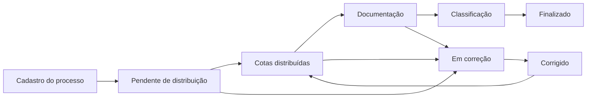

# Software Hub — Sistema de Registro de Propriedade Intelectual

O **Software Hub** é uma plataforma desenvolvida para o **Núcleo de Inovação Tecnológica — NIT**, com o objetivo de gerenciar processos de registro, acompanhamento e proteção de ativos de propriedade intelectual.

O sistema permite o cadastro de processos, autores, documentos, justificativas, classificações, distribuição de cotas e acompanhamento das etapas necessárias até a finalização do registro.

## 📌 Objetivo

Centralizar e organizar o fluxo de registro de propriedade intelectual, substituindo processos manuais e documentos descentralizados por uma plataforma digital integrada.

O sistema busca proporcionar:

* Padronização dos processos de registro;
* Controle das etapas de cada processo;
* Gerenciamento de autores internos e externos;
* Distribuição e versionamento de cotas de participação;
* Classificação dos ativos por áreas de aplicação;
* Gerenciamento de documentos e justificativas;
* Aceite de termos de ciência e concordância;
* Histórico e rastreabilidade das alterações;
* Maior segurança e transparência das informações.

## 🚀 Funcionalidades

### Autenticação e usuários

* Login de usuários;
* Cadastro de novos usuários;
* Recuperação de senha;
* Controle de acesso baseado em perfis e permissões;
* Consulta dos dados do usuário autenticado.

### Processos de propriedade intelectual

* Cadastro de processos;
* Edição de processos existentes;
* Consulta detalhada;
* Busca por título;
* Filtro por status;
* Paginação;
* Inclusão de autores internos;
* Inclusão de autores externos;
* Associação com tipos de propriedade intelectual;
* Formulários dinâmicos de acordo com o tipo selecionado;
* Inativação de processos;
* Acompanhamento do histórico e das etapas do processo.

### Distribuição de cotas

* Cadastro da distribuição de participação;
* Distribuição entre universidade, criadores e colaboradores;
* Validação da soma total de 100%;
* Percentual mínimo de participação para criadores;
* Percentual institucional configurado para a universidade;
* Versionamento das distribuições;
* Solicitação de alteração de cotas;
* Controle da distribuição atualmente ativa.

### Documentos e anexos

* Envio de documentos;
* Download de arquivos;
* Visualização de imagens e arquivos PDF;
* Controle de documentos obrigatórios;
* Validação de documentos pendentes;
* Associação dos anexos ao processo.

### Justificativas

* Cadastro de justificativas;
* Edição e exclusão;
* Envio de arquivo juntamente com a justificativa;
* Visualização do histórico de justificativas;
* Ordenação por data de criação.

### Classificação por área de aplicação

* Cadastro de áreas de aplicação;
* Cadastro de campos de aplicação;
* Visualização em estrutura hierárquica;
* Busca por descrição;
* Seleção de múltiplos campos;
* Edição da classificação;
* Associação dos campos ao processo.

### Termos de ciência e concordância

* Cadastro de termos;
* Associação do termo ao tipo de propriedade intelectual;
* Controle de versão;
* Registro do aceite pelo usuário;
* Verificação de aceite anterior.

## 🔄 Fluxo do processo

Os processos podem passar pelos seguintes status:

| Status                        | Descrição                          |
| ----------------------------- | ---------------------------------- |
| `PENDENTE_DISTRIBUICAO_COTAS` | Aguardando distribuição de cotas   |
| `COTAS_DISTRIBUIDAS`          | Distribuição de cotas concluída    |
| `CORRECAO`                    | Processo enviado para correção     |
| `CORRIGIDO`                   | Correções realizadas               |
| `CLASSIFICADO`                | Campos de aplicação definidos      |
| `PENDENTE_DOCUMENTACAO`       | Aguardando documentos obrigatórios |
| `FINALIZADO`                  | Processo concluído                 |
| `INATIVO`                     | Processo inativado                 |

Fluxo geral:



O fluxo pode variar de acordo com a ordem em que a distribuição de cotas, os documentos e a classificação forem realizados.

## 🛠️ Tecnologias utilizadas

### Backend

* Java 17;
* Spring Boot 3;
* Spring Web;
* Spring Data JPA;
* Spring Security;
* Bean Validation;
* PostgreSQL;
* MapStruct;
* Lombok;
* Hypersistence Utils;
* Armazenamento de dados dinâmicos utilizando `JSONB`;
* OpenAPI e Swagger;
* Maven.

### Frontend

* Flutter Web;
* Dart;
* GetX;
* Clean Architecture;
* Gerenciamento de rotas com GetX;
* Consumo de API REST;
* Formulários dinâmicos;
* Layout responsivo.

### Infraestrutura

* Docker;
* Docker Compose;
* PostgreSQL;
* pgAdmin;
* Nginx;
* GitLab CI/CD;
* GitLab Runner;
* Portainer.

## 🏗️ Arquitetura

O projeto segue uma divisão entre frontend, backend, banco de dados e infraestrutura.

```text
software-hub/
├── backend/
│   ├── src/
│   │   ├── main/java/
│   │   │   └── com/nitssrpi/
│   │   │       ├── config/
│   │   │       ├── controller/
│   │   │       ├── dto/
│   │   │       ├── mapper/
│   │   │       ├── model/
│   │   │       ├── repository/
│   │   │       ├── security/
│   │   │       └── service/
│   │   └── main/resources/
│   │       └── application.yml
│   ├── Dockerfile
│   └── pom.xml
│
├── frontend/
│   ├── lib/
│   │   ├── domain/
│   │   ├── infra/
│   │   ├── external/
│   │   └── presentation/
│   ├── Dockerfile
│   └── pubspec.yaml
│
├── docker-compose.yml
├── .gitlab-ci.yml
└── README.md
```

## ✅ Pré-requisitos

Para executar o projeto utilizando Docker:

* Docker;
* Docker Compose.

Para executar os serviços separadamente:

* Java 17;
* Maven;
* Flutter SDK;
* Dart SDK;
* PostgreSQL.

## 🔐 Variáveis de ambiente

Crie um arquivo `.env` na raiz do projeto:

```env
POSTGRES_DB=nitsrpi
POSTGRES_USER=postgres
POSTGRES_PASSWORD=altere_esta_senha

PGADMIN_DEFAULT_EMAIL=admin@admin.com
PGADMIN_DEFAULT_PASSWORD=altere_esta_senha

SPRING_DATASOURCE_URL=jdbc:postgresql://postgres:5432/nitsrpi
SPRING_DATASOURCE_USERNAME=postgres
SPRING_DATASOURCE_PASSWORD=altere_esta_senha

JWT_SECRET=adicione_uma_chave_segura

SENDINBLUE_SMTP_USERNAME=usuario_smtp
SENDINBLUE_SMTP_KEY=chave_smtp

FILE_UPLOAD_DIR=/app/uploads
```

Para gerar uma chave segura:

```bash
openssl rand -base64 64
```

> O arquivo `.env` não deve ser enviado para o repositório.

Adicione ao `.gitignore`:

```gitignore
.env
uploads/
secrets/
*.log
```

## 🐳 Executando com Docker

Na raiz do projeto, execute:

```bash
docker compose up -d --build
```

Para visualizar os containers:

```bash
docker compose ps
```

Para acompanhar os logs:

```bash
docker compose logs -f
```

Para acompanhar apenas os logs do backend:

```bash
docker compose logs -f backend
```

Para interromper os containers:

```bash
docker compose down
```

Para remover também os volumes do banco de dados:

```bash
docker compose down -v
```

> O comando com `-v` exclui os dados armazenados no PostgreSQL.

## 💻 Executando o backend localmente

Entre na pasta do backend:

```bash
cd backend
```

Execute o projeto com Maven:

```bash
./mvnw spring-boot:run
```

Ou:

```bash
mvn spring-boot:run
```

O backend ficará disponível, por padrão, em:

```text
http://localhost:8080
```

## 📱 Executando o frontend localmente

Entre na pasta do frontend:

```bash
cd frontend
```

Instale as dependências:

```bash
flutter pub get
```

Execute no navegador:

```bash
flutter run -d chrome
```

Para gerar a versão de produção:

```bash
flutter build web
```

Os arquivos serão gerados em:

```text
build/web
```

## 📚 Documentação da API

Com o backend em execução, a documentação Swagger pode ser acessada em:

```text
http://localhost:8080/swagger-ui/index.html
```

A especificação OpenAPI pode ser acessada em:

```text
http://localhost:8080/v3/api-docs
```

## 🔗 Principais endpoints

### Processos

```http
POST   /process
GET    /process/{id}
DELETE /process/{id}
PATCH  /process/{id}/status
PATCH  /process/{id}/classification
GET    /process/user/processes
GET    /process/status/amount
```

### Distribuição de cotas

```http
POST /process-royalty-distribution
PUT  /process-royalty-distribution
```

### Justificativas

```http
POST   /justification
PUT    /justification
DELETE /justification/{id}
GET    /justification/attachments/{id}/file
```

### Termos

```http
GET  /consent-term/ip-types/{id}
POST /consent-term-acceptance
GET  /consent-term-acceptance/was-accepted
```

### Tipos de propriedade intelectual

```http
GET    /ip-types
GET    /ip-types/{id}
POST   /ip-types
PUT    /ip-types/{id}
DELETE /ip-types/{id}
```

> Os caminhos devem ser ajustados caso o projeto ainda utilize o padrão `/ip_types`.

## 🗃️ Banco de dados

O sistema utiliza PostgreSQL.

Principais entidades:

* `Process`;
* `User`;
* `IpTypes`;
* `ExternalAuthor`;
* `Justification`;
* `JustificationAttachment`;
* `ProcessRoyaltyDistribution`;
* `RoyaltyShare`;
* `ApplicationArea`;
* `ApplicationField`;
* `ConsentTerm`;
* `ConsentTermAcceptance`.

Os formulários específicos de cada tipo de propriedade intelectual são armazenados utilizando campos `JSONB`.

## 📂 Upload de arquivos

Os arquivos enviados pelo sistema são armazenados no diretório configurado pela variável:

```env
FILE_UPLOAD_DIR=/app/uploads
```

Em ambiente Docker, recomenda-se utilizar um volume persistente:

```yaml
volumes:
  - uploads-data:/app/uploads
```

Isso evita que os arquivos sejam perdidos quando o container for recriado.

## 🔄 Integração contínua e deploy

O projeto utiliza GitLab CI/CD para automatizar as etapas de:

1. Validação do código;
2. Compilação do frontend;
3. Compilação do backend;
4. Construção das imagens Docker;
5. Publicação das imagens;
6. Deploy no servidor;
7. Atualização dos serviços no Portainer.

As informações sensíveis devem ser cadastradas em:

```text
GitLab → Settings → CI/CD → Variables
```

Exemplos de variáveis:

```text
POSTGRES_PASSWORD
JWT_SECRET
SENDINBLUE_SMTP_KEY
DEPLOY_HOST
DEPLOY_USER
DEPLOY_PRIVATE_KEY
```

As variáveis de produção não devem ser adicionadas diretamente ao arquivo `.gitlab-ci.yml`.

## 🌿 Padrão de branches

Sugestão de organização:

```text
main
develop
feature/nome-da-funcionalidade
fix/descricao-da-correcao
hotfix/descricao-do-problema
release/numero-da-versao
```

Exemplo:

```bash
git checkout -b feature/distribuicao-cotas
```

## 📝 Padrão de commits

Exemplos:

```text
feat: adiciona distribuição de cotas
fix: corrige carregamento dos autores do processo
refactor: reorganiza controller de processos
docs: atualiza documentação do projeto
test: adiciona testes do serviço de processos
chore: atualiza dependências
```

## 🧪 Testes

Para executar os testes do backend:

```bash
cd backend
./mvnw test
```

Para executar os testes do frontend:

```bash
cd frontend
flutter test
```

## 🗺️ Melhorias futuras

* Implementação de notificações;
* Envio automático de e-mails;
* Assinatura digital de documentos;
* Histórico completo de alterações;
* Dashboard administrativo;
* Relatórios em PDF;
* Exportação de dados;
* Ampliação dos testes automatizados;
* Auditoria de ações;
* Integração com sistemas institucionais;
* Melhorias de acessibilidade;
* Implementação de observabilidade e monitoramento.

## 🤝 Contribuição

Para contribuir com o projeto:

1. Crie uma branch a partir da `develop`;
2. Implemente a funcionalidade ou correção;
3. Realize os testes;
4. Faça commits seguindo o padrão do projeto;
5. Envie a branch para o GitLab;
6. Abra um Merge Request para a branch `develop`.

## 👨‍💻 Desenvolvimento

Projeto desenvolvido para o **Núcleo de Inovação Tecnológica — NIT**, com foco na modernização e digitalização dos processos de registro de propriedade intelectual.

## 📄 Licença

Este projeto é de uso institucional.

A utilização, distribuição, modificação ou reprodução do código deve respeitar as regras e autorizações definidas pela instituição responsável.
